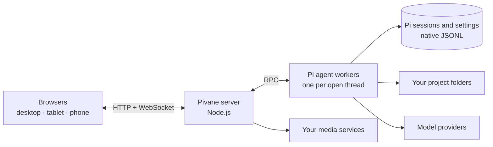

<div align="center">


# Pivane

**A self-hosted web workspace for AI coding agents, usable from any screen.**

Run the [Pi coding agent](https://pi.dev) on your own machine and use it from any browser on your desktop, tablet or phone.<br>
Subagents, scheduled tasks, MCP, long-term memory, rich file previews and a built-in image, video and speech lab work with your own models and keys.

[](https://github.com/YogurtJ/pivane/releases/latest)
[](LICENSE)
[](docs/en/INSTALL.md)
[](#platforms)
[](https://pi.dev)

**English** · [简体中文](README.zh-CN.md)

[Download](https://github.com/YogurtJ/pivane/releases/latest) · [Install](docs/en/INSTALL.md) · [User guide](docs/en/USER_GUIDE.md) · [Changelog](CHANGELOG.md) · [Report an issue](https://github.com/YogurtJ/pivane/issues)


</div>

## Why Pivane

- **Uses Pi's own runtime.** Pivane runs Pi's native runtime and reads and writes Pi's own session files. You get streaming replies, tool calls, file diffs, shell commands, steering and context compaction in a UI that is easy to read on any screen.
- **Start on your desktop and check in from your phone.** Sessions are stored on your server. When you open a thread on another device, the same agent process serves it. You can add Pivane to your home screen and get notified when a reply finishes.
- **Run many agents from one workspace.** You can use subagents, task threads that agents create for themselves, messages between threads, side chats and cron-scheduled tasks. A live view shows what each one is doing.
- **Your models, your keys, your machine.** You can use any provider Pi supports, including Anthropic, OpenAI, Google Gemini, GitHub Copilot, OpenRouter, DeepSeek, Qwen, Kimi, MiniMax, xAI and Mistral. Sign in with an API key or OAuth, or add your own OpenAI-compatible endpoint. Credentials and history stay on your machine.
- **Extends the same way Pi does.** Pi packages, skills, prompt templates and MCP servers can be installed from the browser. You can also ask the built-in extension assistant to find and set them up for you.
- **Media generation and voice are built in.** Connect your own image, video and speech services. An agent turns your idea into parameters you can edit, and nothing runs until you confirm. You can also dictate messages and have replies read aloud.

### See it in action

The agent plans the task, reads and edits files, runs the tests and reports back. When it finishes, the whole process folds into a one-line summary that you can expand at any time.

<p align="center"></p>

<sub>Screenshots and recordings use a synthetic demo project.</sub>

## Features

### Agent workspace

- Threads are organized by project and run directly in folders on the server.
- Replies stream in with thinking, tool calls and the files changed in each turn. The default compact view folds each finished turn into a one-line "time · tool calls" summary.
- You can attach images and files by paste or drag-and-drop, reference project files with `@`, or quote a text selection into your next message. DOCX, XLSX, PPTX and PDF uploads keep their originals, and the agent reads selected ranges on demand.
- While a task runs, you can steer it or queue a follow-up. You can also stop, retry or compact the context.
- `!command` runs a shell command on the server, and `!!command` keeps its output out of the model context.
- The model picker has search, favorites that sync across devices, per-model thinking levels and a context usage meter.
- A progress card shows the plan the agent is following.

### Sessions and history

- Sessions use Pi's native JSONL files, so they stay compatible with Pi CLI and are never copied into a separate chat database.
- You can search the full text of all threads, bookmark messages, browse the session tree, fork a conversation, or edit and retry a message.
- You can import Pi sessions and export them as HTML or JSONL.
- Projects and threads can be archived, and a thread can be moved to another project. New threads get generated titles automatically.

### Multi-agent and automation


- Subagents are built in through [pi-subagents](https://pi.dev/packages/pi-subagents). A live panel shows each run's status and models, lets you steer, stop or continue it, and reports token usage and cost.
- An agent can start a new task thread or message another thread in the same project.
- A side chat lets you ask a quick question without derailing the main task. It can read files and, with your approval for that reply, make small edits.
- Scheduled tasks can be cron-based or one-time. They support time zones, previews of upcoming runs, budgets and run history.

### Assistants with memory

- Assistant profiles each have their own persona, notes about you and long-term memory, powered by [pi-hermes-memory](https://pi.dev/packages/pi-hermes-memory?name=memory).
- Optional background learning picks up your corrections and preferences. It runs within daily budgets, and every memory and learned skill can be reviewed, edited or undone.
- Several logical projects with their own instructions can point to the same directory.

### Files and rendering

- You can browse and search project files, review each turn's diff and compare it with the current file.
- Previews cover Markdown, code, images, PDF, CSV/TSV, SVG, audio and sandboxed HTML. Full-screen reading keeps your position; images support pan and zoom, and PDFs keep the page and zoom level.
- Agents can publish finished files as unchangeable snapshots that you can open and download from the chat.
- Markdown is rendered with syntax highlighting, LaTeX math (KaTeX) and Mermaid diagrams.

### Extensions and MCP

- You can manage Pi packages, skills, extensions, prompt templates and themes globally or for a single project.
- MCP uses Pi's native support, including Codemode and tool search. Servers and OAuth sign-ins are managed in the browser.
- A discovery page lists recommended packages. An extension assistant checks their sources and installs them only after you ask.
- You can edit the system prompt and inspect the full prompt that any thread receives.

### Media lab and voice


- You can add image, video, text-to-speech and speech-to-text services. Presets cover OpenAI, Google Gemini, Volcengine Ark (Seedream and Seedance) and Alibaba Cloud Model Studio, and any compatible HTTP API can be added manually.
- An agent drafts editable parameters from a plain-language request in chat or the lab. Each generation runs only after you confirm it; busy requests queue, and the same status returns after a refresh. Reference images or videos can be attached when the model supports them.
- Generation history lets you preview, reuse and download earlier results.
- You can dictate messages into the composer and have replies or selected text read aloud.

### Everyday use


- Layouts adapt to desktop, tablet and phone screens, and Pivane can be installed to your home screen.
- In-page notifications and sounds are available, with optional Web Push for background alerts.
- A usage dashboard breaks down tokens and estimated cost by day, provider, model, project and session.
- Light and dark color themes, adjustable font sizes, and an English or Simplified Chinese interface are available.
- An access token protects the workspace. Pivane runs as a background service with a desktop shortcut. It checks for new releases and gives you an upgrade prompt to hand to an agent on the host.

## Quick start

You need **Node.js 22** with npm, plus `bash` and [ripgrep](https://github.com/BurntSushi/ripgrep) (on Windows, Git for Windows provides Bash). You also need an account with a model provider. You do not need a global Pi installation, a frontend build step or a GPU.

```bash
# 1. Download pivane-<version>.tar.gz and its .sha256 file from Releases, then verify the archive
sha256sum -c pivane-<version>.tar.gz.sha256    # macOS: shasum -a 256 -c …
tar -xzf pivane-<version>.tar.gz && cd pivane-<version>

# 2. Install the locked dependencies, including the pinned Pi runtime
node scripts/install.cjs

# 3. Run it in the foreground to try it out
npm start
```

Open <http://127.0.0.1:11408>, check **Settings → Providers and models**, pick a project folder and start a new chat.

For everyday use, follow the [installation guide](docs/en/INSTALL.md) to keep your data outside the app directory, then run `node scripts/install-service.cjs`. This keeps Pivane running in the background and starts it when you log in. On macOS and Windows, it also adds a desktop shortcut.

> **Already using Pi CLI?** Pivane uses the same Pi identity by default, so your models, logins, settings and sessions are available right away. Avoid writing to the same session from the CLI and the browser at the same time. See [existing Pi users](docs/en/INSTALL.md#existing-pi-cli-users).
>
> **Want an agent to set it up?** Give your coding agent this repository and the [agent operations guide](docs/AGENT_GUIDE.md). It covers installation, configuration, upgrades and troubleshooting.

## Platforms

Pivane runs **natively on Linux, macOS and Windows** (no WSL or Docker required). It is light enough to host on a Raspberry Pi, and you can use it from any modern browser.

Pivane listens on localhost by default. To reach it from your phone or another computer, turn on the access token, then connect over your LAN, a VPN such as Tailscale, or an HTTPS reverse proxy. See [Network & access](docs/en/USER_GUIDE.md#network--access).

## How it works



- A Node.js server (Express and WebSocket) serves a plain JavaScript frontend, so there is no build step.
- Each persistent thread is served by exactly one Pi worker process, and every browser that opens the thread connects to that worker.
- Pi's SessionManager and JSONL files are the only record of each conversation. Usage statistics are kept in a separate ledger that stores no message content.
- Each Pivane release bundles a tested version of Pi, which is upgraded together with Pivane.

## Security model

- Pivane is meant for **personal, single-user** instances. Everyone who has the access token shares the same instance, and there are no separate user accounts.
- Project roots limit which folders you can browse, but they are **not a sandbox**. The agent, shell, packages and extensions all run with the permissions of the server's user account, so install only extensions you trust.
- Media generation and other paid actions run only after you explicitly confirm them. Pivane never retries failed or uncertain requests automatically.

## FAQ

**Is it a replacement for Pi CLI?** No, it is a companion. Both share the same Pi identity, so you can use whichever fits the moment.

**Does it need a GPU?** No. Models run at your providers or on endpoints you configure.

**How do I upgrade?** **Settings → Versions and updates** shows when a new release is available. It gives you a prompt you can hand to an agent on the host. Back up before switching versions, as described in [installation and recovery](docs/en/INSTALL.md#backups-upgrades-and-recovery).

**Which languages are supported?** The interface is available in English and Simplified Chinese. Your conversations can be in any language your model supports.

## Documentation

| Topic | Where to start |
|---|---|
| Install, upgrade and recover | [Installation guide](docs/en/INSTALL.md) · [Background service](docs/BACKGROUND_SERVICE.md) |
| Daily use | [User guide](docs/en/USER_GUIDE.md) |
| All features, in detail (mostly in Chinese) | [Documentation index](docs/README.md) |
| REST and WebSocket API | [API reference](docs/API.md) |
| Help from your own agent | [Agent operations guide](docs/AGENT_GUIDE.md) |
| What's new and what's next | [Changelog](CHANGELOG.md) · [Releases](https://github.com/YogurtJ/pivane/releases) · [Roadmap](docs/ROADMAP.md) |

## Contributing

Bug reports, ideas and pull requests are welcome in [Issues](https://github.com/YogurtJ/pivane/issues). When reporting a problem, include your Pivane version and the shortest steps that reproduce it. Remove credentials and private content from logs and screenshots first.

To set up a development environment, run `node scripts/install.cjs`, then check your changes with `npm test` and `npm run check`. Read [CONTRIBUTING.md](CONTRIBUTING.md) and the [development docs](docs/development/README.md) first. Coding agents should also read [AGENTS.md](AGENTS.md).

## License

Pivane is released under the [ISC License](LICENSE). Pi, Font Awesome, KaTeX, Mermaid and other bundled components keep their own licenses; see [Third-party notices](THIRD_PARTY_NOTICES.md).
