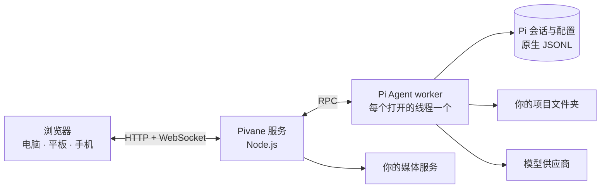

<div align="center">


# Pivane

**自托管的 AI 编程 Agent 网页工作台，电脑、平板、手机都能接着用。**

把 [Pi Coding Agent](https://pi.dev) 部署在自己的机器上，用任何设备的浏览器使用它。<br>
子 Agent、定时任务、MCP、长期记忆、丰富的文件预览，以及内置的图像、视频、语音实验室，都用你自己的模型和 Key。

[](https://github.com/YogurtJ/pivane/releases/latest)
[](LICENSE)
[](docs/INSTALL_RECOVERY.md)
[](#支持平台)
[](https://pi.dev)

[English](README.md) · **简体中文**

[下载](https://github.com/YogurtJ/pivane/releases/latest) · [安装](docs/INSTALL_RECOVERY.md) · [用户指南](docs/USER_GUIDE.md) · [变更记录](CHANGELOG.md) · [反馈问题](https://github.com/YogurtJ/pivane/issues)


</div>

## 为什么选择 Pivane

- **直接使用 Pi 自己的运行时。** Pivane 运行 Pi 的原生运行时，直接读写 Pi 自己的会话文件。流式回复、工具调用、文件差异、Shell 命令、任务引导和上下文压缩都可以使用，界面在任何屏幕上都便于阅读。
- **在电脑上开始，在手机上查看进度。** 会话保存在你的服务器上。在另一台设备上打开同一个线程时，仍由同一个 Agent 进程提供服务。Pivane 可以添加到手机主屏幕，回复完成时会通知你。
- **在一个工作台里同时运行多个 Agent。** 你可以使用子 Agent、Agent 自己创建的任务线程、线程间消息、侧聊和按 cron 运行的定时任务，并实时查看每个 Agent 正在做什么。
- **模型、Key 和机器都由你掌控。** Pi 支持的供应商都可以使用，包括 Anthropic、OpenAI、Google Gemini、GitHub Copilot、OpenRouter、DeepSeek、通义千问、Kimi、MiniMax、xAI 和 Mistral。可以用 API Key 或 OAuth 登录，也可以添加自己的 OpenAI 兼容服务。凭据和历史都保存在你自己的机器上。
- **扩展方式和 Pi 一样。** Pi 的 Packages、Skills、提示词模板和 MCP 服务器都可以在浏览器里安装。也可以让内置的扩展助手帮你查找和配置。
- **内置媒体生成和语音。** 可以接入自己的图像、视频和语音服务。Agent 会把你的想法整理成可编辑的参数，你确认后才会执行。也可以用语音输入消息，或让回复朗读出来。

### 实际运行效果

Agent 会先列出计划，再读取和修改文件、运行测试并汇报结果。任务完成后，整个过程会收成一行摘要，需要时随时可以展开查看。

<p align="center"></p>

<sub>截图和录屏使用的是合成的演示项目。</sub>

## 功能

### Agent 工作台

- 线程按项目组织，直接在服务器上的文件夹里工作。
- 回复会流式显示思考过程、工具调用和本轮修改的文件。默认的简洁视图会把每个已完成的轮次收成一行“用时 · 工具调用”摘要。
- 可以粘贴或拖放图片和文件作为附件，用 `@` 引用项目文件，也可以把选中的文字引用到下一条消息里。上传 DOCX、XLSX、PPTX 和 PDF 会保留原件，Agent 按需读取选定范围。
- 任务运行时，可以发送引导或排队一条后续消息，也可以停止、重试或压缩上下文。
- `!命令` 在服务器上执行 Shell 命令；`!!命令` 的输出不会进入模型上下文。
- 模型选择器支持搜索、跨设备同步的常用模型、按模型调整的思考等级，并显示上下文用量。
- 进度卡会显示 Agent 正在执行的计划。

### 会话与历史

- 会话使用 Pi 原生的 JSONL 文件，因此与 Pi CLI 保持兼容，不会另外复制到单独的聊天数据库。
- 可以全文搜索所有线程、给消息加书签、查看会话树、分叉对话，或编辑消息后重试。
- 可以导入 Pi 会话，也可以导出为 HTML 或 JSONL。
- 项目和线程可以归档，线程可以移动到其他项目。新线程会自动生成标题。

### 多 Agent 与自动化


- 内置 [pi-subagents](https://pi.dev/packages/pi-subagents) 子 Agent。实时面板显示每次运行的状态和所用模型，可以引导、停止或继续运行，并统计 token 用量和费用。
- Agent 可以新开任务线程，也可以给同一项目里的其他线程发消息。
- 侧聊可以让你临时问个问题，不打断主任务。它可以读取文件；在你为当次回复授权后，也可以做小范围修改。
- 定时任务支持 cron 和单次执行，可以设置时区，预览接下来的运行时间，设置预算并查看运行记录。

### 带记忆的助手

- 每个助手身份都有自己的人设、关于你的偏好记录和长期记忆，由 [pi-hermes-memory](https://pi.dev/packages/pi-hermes-memory?name=memory) 提供支持。
- 可以开启后台学习，从你的纠正和偏好中学习。学习受每日预算限制，每条记忆和学到的技能都可以查看、修改或撤销。
- 多个逻辑项目可以指向同一个目录，并各自带有项目指令。

### 文件与渲染

- 可以浏览和搜索项目文件，查看每轮的修改差异，并与当前文件对照。
- 支持预览 Markdown、代码、图片、PDF、CSV/TSV、SVG、音频，以及在隔离环境中显示的 HTML。全屏阅读保留位置，图片支持拖动和缩放，PDF 保留页码与缩放。
- Agent 可以把完成的文件发布为不可更改的快照，你可以在聊天里直接打开和下载。
- Markdown 支持代码高亮、LaTeX 公式（KaTeX）和 Mermaid 图表。

### 扩展与 MCP

- 可以在全局或单个项目范围内管理 Pi 的 Packages、Skills、扩展、提示词模板和主题。
- MCP 使用 Pi 的原生支持，包括 Codemode 和工具搜索。MCP 服务器和 OAuth 登录都在浏览器里管理。
- 发现页列出推荐的扩展包。扩展助手会先核对来源，你要求后才会安装。
- 可以编辑系统提示词，并查看任一线程实际收到的完整提示词。

### 多媒体实验室与语音


- 可以接入图像、视频、语音合成和语音转写服务。预设包括 OpenAI、Google Gemini、火山方舟（Seedream 和 Seedance）和阿里云百炼，其他兼容的 HTTP API 可以手动添加。
- Agent 会在聊天或实验室里根据自然语言描述起草可编辑的参数。每次生成都要你确认后才会执行；忙时排队，刷新后恢复同一状态。模型支持时，还可以附上参考图片或视频。
- 生成历史可以预览、复用和下载以前的结果。
- 可以用语音在输入框里输入消息，也可以让回复或选中的文字朗读出来。

### 日常使用


- 布局会适应电脑、平板和手机屏幕，Pivane 也可以添加到手机主屏幕。
- 提供页面通知和提示音，并可选开启 Web Push 后台提醒。
- 用量统计按日期、供应商、模型、项目和会话汇总 token 和估算费用。
- 提供浅色和深色主题，可以调整字号，界面可选英文或简体中文。
- 工作台用访问 Token 保护。Pivane 作为后台服务运行，并提供桌面入口。它会检查新版本，并生成升级提示词，你可以交给部署机器上的 Agent 执行。

## 快速开始

需要 **Node.js 22**（含 npm）、`bash` 和 [ripgrep](https://github.com/BurntSushi/ripgrep)（Windows 上可以通过 Git for Windows 获得 Bash），以及一个模型供应商的账户。不需要全局安装 Pi，不需要构建前端，也不需要 GPU。

```bash
# 1. 从 Releases 下载 pivane-<version>.tar.gz 及其 .sha256 文件，然后校验压缩包
sha256sum -c pivane-<version>.tar.gz.sha256    # macOS：shasum -a 256 -c …
tar -xzf pivane-<version>.tar.gz && cd pivane-<version>

# 2. 安装锁定版本的依赖，其中包括固定版本的 Pi 运行时
node scripts/install.cjs

# 3. 先在前台运行试用
npm start
```

打开 <http://127.0.0.1:11408>，检查 **设置 → 供应商与模型**，选择一个项目文件夹，然后开始新聊天。

日常使用时，请按[安装指南](docs/INSTALL_RECOVERY.md)（另有 [macOS](docs/MACOS.md) 和 [Windows](docs/WINDOWS.md) 版本）把数据放在应用目录之外，然后运行 `node scripts/install-service.cjs`。这样 Pivane 会在后台运行，并在你登录时自动启动；在 macOS 和 Windows 上还会添加桌面入口。

> **已经在用 Pi CLI？** Pivane 默认使用同一个 Pi 身份，你的模型、登录、设置和会话都能直接使用。请不要同时从 CLI 和网页写入同一个会话。详见[已有 Pi 接入](docs/PI_CLI.md)。
>
> **想让 Agent 帮你部署？** 把这个仓库和[用户 Agent 操作指南](docs/AGENT_GUIDE.md)交给你的编程 Agent。指南涵盖安装、配置、升级和排障。

## 支持平台

Pivane 可以**直接在 Linux、macOS 和 Windows 上运行**，不需要 WSL 或 Docker。它足够轻量，可以部署在树莓派上，并且可以用任何现代浏览器访问。

Pivane 默认只监听本机。如果要从手机或其他电脑访问，请先开启访问 Token，然后通过局域网、Tailscale 等 VPN，或 HTTPS 反向代理连接。详见[网络与访问](docs/ACCESS_CONTROL.md)。

## 工作原理



- Node.js 服务（Express 和 WebSocket）提供纯 JavaScript 前端，不需要构建步骤。
- 每个持久线程只由一个 Pi worker 进程提供服务，打开这个线程的所有浏览器都连接到同一个 worker。
- Pi 的 SessionManager 和 JSONL 文件是每段对话唯一的记录。用量统计保存在单独的账本里，不保存消息内容。
- 每个 Pivane 版本都内置一个经过测试的 Pi 版本，Pi 随 Pivane 一起升级。

## 安全模型

- Pivane 面向**个人、单用户**的实例。拿到访问 Token 的人共用同一个实例，没有单独的用户账户。
- 项目根目录限制了可以浏览的文件夹，但它**不是沙箱**。Agent、Shell、Packages 和扩展都以服务器用户的权限运行，请只安装你信任的扩展。
- 媒体生成和其他付费操作都要你明确确认后才会执行。失败或结果不确定的请求不会自动重试。

## 常见问题

**它能替代 Pi CLI 吗？** 不能，它是 Pi CLI 的搭档。两者共用同一个 Pi 身份，你可以根据场景选择使用哪一个。

**需要 GPU 吗？** 不需要。模型运行在你的供应商那里，或运行在你自己配置的服务上。

**怎么升级？** **设置 → 版本与更新**会提示新版本，并生成一段提示词，你可以交给部署机器上的 Agent 执行。切换版本前请先备份，步骤见[安装与恢复](docs/INSTALL_RECOVERY.md)。

**支持哪些语言？** 界面支持英文和简体中文。对话可以使用你的模型支持的任何语言。

## 文档

| 主题 | 入口 |
|---|---|
| 安装、升级与恢复 | [安装与恢复](docs/INSTALL_RECOVERY.md) · [macOS](docs/MACOS.md) · [Windows](docs/WINDOWS.md) · [后台服务](docs/BACKGROUND_SERVICE.md) |
| 日常使用 | [用户指南](docs/USER_GUIDE.md) |
| 全部功能详解 | [文档目录](docs/README.md) |
| REST 和 WebSocket API | [API 参考](docs/API.md) |
| 让自己的 Agent 帮忙 | [用户 Agent 操作指南](docs/AGENT_GUIDE.md) |
| 版本变化与后续计划 | [变更记录](CHANGELOG.md) · [Releases](https://github.com/YogurtJ/pivane/releases) · [路线图](docs/ROADMAP.md) |

## 参与贡献

欢迎在 [Issues](https://github.com/YogurtJ/pivane/issues) 提交问题报告、建议和 PR。报告问题时，请写明 Pivane 版本和最短的复现步骤；日志和截图请先去除凭据和私人内容。

搭建开发环境时，先运行 `node scripts/install.cjs`，再用 `npm test` 和 `npm run check` 检查改动。请先阅读[贡献指南](CONTRIBUTING.md)和[开发文档](docs/development/README.md)。编程 Agent 还应阅读 [AGENTS.md](AGENTS.md)。

## 许可证

Pivane 使用 [ISC 许可证](LICENSE)。Pi、Font Awesome、KaTeX、Mermaid 等内置组件保留各自的许可证，详见[第三方声明](THIRD_PARTY_NOTICES.md)。
