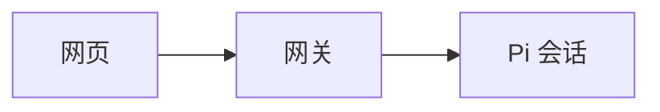

# Mermaid 图表

回复中的 `mermaid` 围栏代码块自动显示为图表，覆盖主聊天、BTW 侧聊及右侧 Markdown 文件预览。无需工具面板或生成服务，已有历史回复刷新后同样可渲染。

````markdown

````

支持 Mermaid 11.17.2 的常规流程图、时序图、状态图、类图等语法。图表按可用宽度缩小，保持原始比例；晴空/薄荷使用明亮配色，夜间使用深色配色。每张图下方可以展开和复制源码，回复末尾复制仍返回原始 Markdown。

流式输出在代码围栏闭合后才绘图；未闭合的代码仍显示源码。语法错误、超过限额或资源加载失败时显示提示和完整源码，不影响普通消息、发送或工具结果。只渲染 Markdown 代码块，不执行工具输出中的文字。

## 展示与隔离

- `public/pi-file-viewer.js` 的共用 Marked renderer 识别完整 Mermaid 围栏；原有 DOMPurify HTML 清理保留。
- `public/pi-mermaid.js` 只观察 Markdown DOM，串行绘制并丢弃已移除节点的迟到结果。至多缓存16份/约200万字符的布局，只有页面内存，不写会话或浏览器存储。
- Mermaid 在 `sandbox=allow-scripts` 的独立 iframe 内运行，无 allow-same-origin、表单、弹窗或顶层导航权限。框架 CSP 禁止连接、外部图片、字体及额外框架，脚本仅从本机静态文件加载。
- 固定 strict 模式、禁用 HTML 标签布局；不接受 `%%{init...}%%` 等配置指令或 YAML frontmatter。图表不是任意 HTML 或配置执行入口。
- 返回的 SVG 再经 DOMPurify SVG profile 清理，去掉链接、外部图片、foreignObject 等，作为 Blob 图片展示。没有可点击图中链接或回调；不把 SVG 样式嵌入工作台 DOM。Blob 在图片解码后释放。
- 每图源码最多20000字符、最多200条边；资源加载15秒、单图绘制10秒超时后回退源码。超时不能中断浏览器主线程上的所有底层计算，复杂图仍应适当拆分。
- 不新增 REST/RPC 或服务器渲染，不改 Pi 包、模型提示词、历史或媒体数据。此次静态资源在3001刷新即生效，无需重启服务。原生 HTML 导出沿用 Pi 上游实现，不受此网页渲染器控制。

## 本地依赖

浏览器离线使用 `public/vendor/mermaid-11.17.2.min.js`，来自 npm 官方包 `mermaid@11.17.2` 的 `dist/mermaid.min.js`；许可证保留为同目录 `mermaid-LICENSE.txt`。该目录的两个文件显式纳入试用包允许清单。主页面按需加载隔离框架，普通无图回复不下载约3.57MB的 Mermaid bundle。

SHA-256：`581ed7d74bd9048d0e3a91363927d72ef22942d7722546b27f7cc29e35390eb8`。

升级时从精确版本 npm 包提取官方 bundle 和 LICENSE，更新文件名、iframe 引用、打包清单、此文档与哈希。在独立临时目录生成该版本的依赖锁并审计，同时执行项目审计及浏览器回归；不覆盖项目 Pi 依赖。11.17.2 的独立依赖审计为0漏洞。

## 验证

```bash
PLAYWRIGHT_MODULE=/path/to/playwright PI_MERMAID_TEST_URL=http://127.0.0.1:3001 node test/browser/pi-mermaid.cjs
```

使用系统 Chromium、mock REST/WebSocket，检查1440/393/320px、三主题、中文流程图/时序图/状态图、源码、流式围栏、错误/配置拒绝、隔离与内部宽度，无真实模型请求或会话写入。截图在 `/tmp/pi-mermaid-*.png`。手机为 Chromium 仿真，未宣称 Safari 真机验证。
