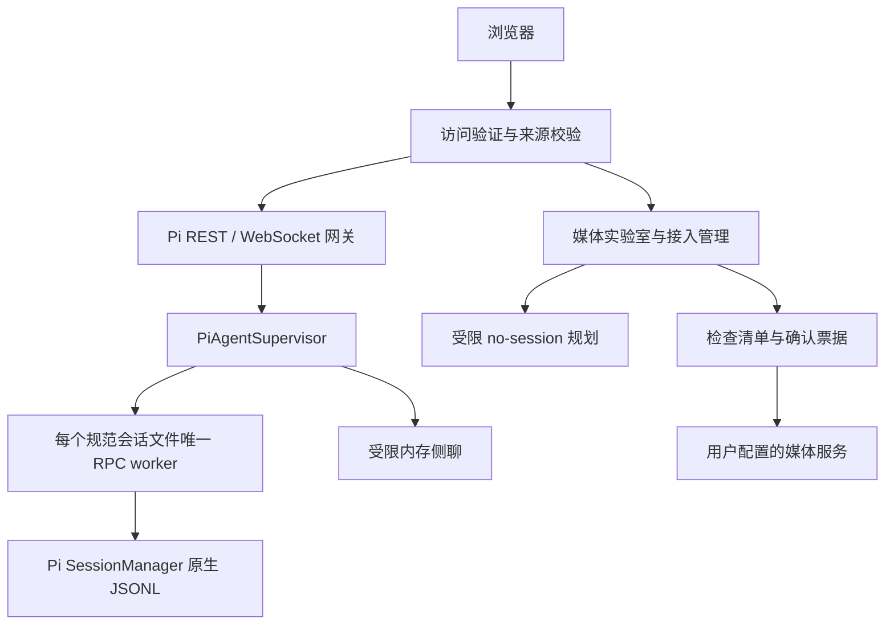

# Pivane 架构

Pivane是一个Express服务及其管理的Pi进程。浏览器使用同源REST/WebSocket与共享静态界面；Pi原生会话管理对话事实，媒体服务独立管理用户确认的生成请求。

## 进程与身份

server.js加载实例环境、创建访问验证服务、Pi网关、媒体管理及静态服务，再监听HTTP/WS。PORT默认3000，HOST由部署配置决定；公开示例采用loopback。Pi 身份在普通安装中可与同一用户的 CLI 共用，媒体数据与预约路径按 Pivane 实例独立配置，端口不决定媒体后端。安装目录解析命令通过公开 `getAgentDir()` 取得身份，不复制认证或初始化会话；平台流程见[已有 Pi 接入](../PI_CLI.md)。普通安装的项目范围默认开放系统用户可访问的目录；隔离验收才使用专用测试项目根。

PiSessionStore 未配置或空 `PI_PROJECT_ROOTS` 时，POSIX 使用 `/`，Windows 在启动时枚举并规范化存在的 A:–Z: 盘符根；显式非空配置完整覆盖默认范围，失效根不触发扩大回退。默认浏览位置仍优先用户主目录，realpath、目录类型与系统权限检查继续生效。

主连接先认证并通过cwd/sessionId解析原生会话，获得state/messages/stats/models/thinking/commands快照。持久worker由规范sessionPath唯一索引，多浏览器订阅同一个worker；临时no-session绑定连接，断开清理。外部CLI不能同时写同一会话。

PiRpcClient使用StringDecoder和严格LF分帧，不能使用readline分割U+2028/U+2029。启动阶段在20秒总预算内用同一进程进行只读get_state就绪探测，迟到探测响应被截获，不重发用户消息或创建额外worker。请求ID关联响应；私有控制响应在Supervisor截获，包括迟到/未知结果。扩展不能替换受管session身份；受控导航只走项目桥接。

保存配置不自动重开运行实例。系统提示词编辑直接管理原生 SYSTEM/APPEND_SYSTEM 文件；正文查看复用唯一 worker 的私有资源管道，按需返回公开提示快照与文件内容比较，不持久化第二份会话上下文，不把推导文件来源或基础内容匹配称为最终供应商请求。保存与资源加载分离，显式空闲重载后再核对，详见[原生提示词契约](../NATIVE_SETTINGS.md#系统提示词查看与编辑)。

进程退出由pi-process-shutdown保持SIGINT/SIGTERM监听并去重异步清理，避免Pi依赖的signal-exit提前重发信号；清理失败不返回成功退出码。复合操作await前预占互斥，超时不等于终止；模型刷新、导航、Shell、停止、压缩、资源重载、队列、预约、配置和导出都计入各自活动与回收边界。部署不得停止承载当前维护会话的进程。

## 原生会话与工作流

PiSessionStore通过公开SessionManager列举、新建、命名与删除。空会话先独占创建文件，再SessionManager.open写有效header，避免原生延迟落盘导致不可见。

历史搜索、书签、会话树来自原生entries/branch/labels；不维护第二份索引或历史。书签推进metadata leaf但不改变消息祖先；导航验证leaf/revision，暂停预约，草稿只回给调用者。复制/分叉使用SessionManager创建新身份，不复制项目目录、不撤销工具副作用。

导出HTML经当前唯一worker，JSONL使用官方当前分支导出；导入先严格验证再SessionManager.forkFrom创建新ID。媒体票据和导出回执的进程内幂等不承诺跨重启事务。相关契约见[历史](../HISTORY.md)、[工作流](../SESSION_WORKFLOWS.md)、[导入导出](../SESSION_TRANSFER.md)。

自动标题服务监听符合资格线程的最终完成，使用私有同步桥接读取有界正文摘录及名称/分支修订，经独立 ModelRuntime.completeSimple 请求后条件保存原生名称。资格/尝试状态仅写原生 custom entry，绑定 session ID；标题请求不占主 prompt 操作锁，运行/导航/手动改名变化使旧结果失效。实例偏好保存开关、独立标题模型引用及设置修订，生成前冻结选择；专用模型不可用不回退。activity 只报生成数及变更代次；没有第二份聊天或标题存储。手动建议的本次模型与用量仅在响应中展示，不累计落盘。异步模型设置校验预占互斥、保存时复核设置修订，计入配置活动/停机等待。生成请求单独计入回收/停机清理，详见[会话工作流](../SESSION_WORKFLOWS.md#自动标题与重新生成)。

侧聊默认通过现有worker只读捕获当前有效背景，私有管道交给SDK内存SessionManager。关闭自动资源发现，工具历史转换为只读证据，思考/签名不转移。`sideChatTools` 启用后，新页面以 toolMode=assist 选择原生 read/grep/find/ls/edit/write 及平台命令工具，只额外加载项目自有的 sideToolGate；原生 tool_call + ctx.ui.confirm 管理逐回复写入/命令授权，不凭提示词自动授权。读取直接执行，拒绝/取消/过期确认阻止修改；SideConnection 只将本侧 pendingUi 中有效 ID 的布尔确认传给 worker，其他管理 RPC 继续拒绝。旧客户端省略 toolMode 保留 none。工具与确认由各 SideThread 独立安全 DOM 展示，后台请求不会借用当前主线程的确认窗口。主侧共享文件，不承诺跨进程事务或隔离。前端只显示继承边界后的新对话，统计扣除继承基线。票据、后台保留与生命周期见[侧聊](../SIDE_CHAT.md)。

## 默认能力与插件设置

`pi-default-capabilities` 是精确版本的可选 Pi Package 清单，目前仅 pi-subagents 0.69.0。postinstall 调用公开 DefaultPackageManager，在实际 Pi 身份内逐项安装；身份内状态文件和独占锁记录尝试，异常不使主依赖安装失败，后续安装不隐式重试或恢复已卸载包。新能力必须加入清单并验证，而非把第三方包作为应用必需依赖。

`pi-subagent-settings-service` 通过原生资源服务检测包版本、安装路径与配置启用状态，投影子 Agent 默认值及角色模型/思考覆盖。写入复用 native 配置互斥、修订、文件身份检查、原生锁和私有原子保存；不引入第二份模型路由。随附角色与已有覆盖只构成设置清单，不冒充插件实际运行发现。版本不匹配则拒绝编辑；将来扩大兼容范围必须单独验证。详情见[子 Agent 设置](../NATIVE_SETTINGS.md#子-agent-专属设置)。

## 扩展助手

扩展助手是带原生 `pi5-extension-assistant` custom entry 的普通持久会话，身份绑定 sessionId。Store 创建和读取元数据，Supervisor 仍按规范 sessionPath 管理唯一 worker；仅助手 worker 获得独立的管理凭据。`pi-extension-assistant-extension.ts` 在 session_start 注册 inventory/package 工具，在 before_agent_start 追加指引，包含实际身份目录、Pi CLI/文档路径和工具状态，不改用户全局提示文件。分叉/导入的新 sessionId 不自动继承助手角色。

专用 HTTP 桥接只允许读取固定范围资源和执行已确认的包操作；写入复用 PiResourceService/PiNativeService 的配置锁、修订、trust 和活动计数，凭据不输出给模型，媒体规划凭据不扩大授权。独立技能和依赖配置仍由正常 Agent 工具承担，不宣称跨工具事务或沙箱。前端两个入口共用创建 dialog，不自动投递消息；请求结束时复核页面/会话代次，迟到创建保留在列表及内存草稿中。管理状态来自原生资源读取，对话来自原生 JSONL。详见[扩展助手](../NATIVE_SETTINGS.md#扩展助手)。

## Agent 任务线程

`pi-agent-threads` 将存活来源 worker 的身份绑定到三个内部端点；扩展工具只能在原项目创建任务、查询自己的 requestId 或读取模型目录。创建 await 前预占名额，先用公开 ModelRuntime 与 SettingsManager 校验并冻结默认/指定配置，再由 Store 在新原生会话保存模型、思考等级、身份绑定的 task custom entry 及可见 Agent 来源 custom message。Supervisor 以原有规范路径唯一 worker 启动，通过私有导航命令触发新轮次，启动回执沿用私有响应截获。

Agent 的 create 工具结果与来源线程可见回执均在原生会话中；没有全局聊天副本。启动失败保留目标线程，重复 requestId 只读已有结果，不重放。终态由 agent_settled 原生扩展事件保存，运行中优先读取现有 activity。来源卡片使用安全 DOM、同项目会话列表解析和页面代次检查跳转；不抢走当前会话。创建中任务计入维护空闲与停机等待。限制和协议见[Agent 任务线程](../AGENT_THREADS.md)。

工具执行来源由受管扩展在 tool_call 时从公开工具 sourceInfo 和已加载技能路径捕获，在 tool_result 中附加有界可选 details，随原生会话持久化。前端只消费与调用 ID/工具名匹配的来源；旧记录不按当前清单追认归属。钩子不读文件或改执行参数，不改变第三方特殊 details 结构；仅作显示说明，不是权限或防篡改审计机制。详见[执行来源契约](../NATIVE_SETTINGS.md#执行记录中的技能与扩展来源)。

## 文件系统与凭据

pi-platform-path处理Windows路径歧义，pi-file-io与pi-file-descriptor统一安全打开、内核路径和对象身份。Linux使用/proc，macOS使用F_GETPATH，Windows通过Node导出的libuv转换HANDLE并查询最终路径/完整File ID。根、私密路径、类型、预算和前后变化校验保留；后端缺失不退化为请求路径。

Windows受保护DACL在私密文件创建时设置，专用配置/导出目录单独保护；关键持久化使用可写fd刷盘和写透替换。POSIX保留0600/目录fsync。原生源码、二进制和manifest一起分发，普通安装不编译；见[组件说明](../../native/README.md)。

工作台访问身份独立于Pi Provider凭据。Cookie/Bearer与Origin分别检查，认证撤销清理失效连接而保留持久任务。Provider凭据通过公开ModelRuntime.login/logout持久化，前端不回显。内部规划身份仅授权指定端点。参考[访问控制](../ACCESS_CONTROL.md)和[模型设置](../PROVIDER_SETTINGS.md)。

## 浏览器状态

public/pi-chat.js协调当前会话、请求代次、流式消息与附件；专用模块管理滚动、正文/完整记录、菜单、历史、文件、侧聊和设置。共享主题/分栏归workspace-ui，后端模型/字段目录不写死在前端。

messages快照与webRuntimeId/webSequence衔接有界live状态，settled后以原生记录校正；message_end/agent_end不是整轮完成依据。Pi 0.86 的原生 `role: system` 提示词/工具检查点属于 provider transcript，不是网页聊天消息；网关在公开边界过滤这些记录，但主会话上下文与导出仍从当前原生 system message 读取。迟到读取按线程、socket代次、revision及草稿版本丢弃。

正文模式仅改变显示，连续思考/工具合并折叠；普通文字、附件、错误、等待确认保留。文件变化只从成功edit/write记录派生，不推算bash或提供净变化/回滚。当前磁盘全文需用户显式读取。

Markdown经marked与DOMPurify。公式由本地KaTeX的独立清理输出生成；Mermaid在无同源权限sandbox中绘制后再次清理为图片。不执行模型HTML或通过展示扩展工具权限。

主题、分栏、正文和界面语言选择可以保存为浏览器偏好；草稿、附件、展开/阅读状态与侧聊内容主要在本页内存。禁止把这些展示状态复制为平行聊天历史。

项目/线程归档在WorkspacePreferencesService的`archives`中只保存规范cwd、原生sessionId与持久修订；独立于hiddenProjects和置顶，不改JSONL或worker生命周期。归档前通过现有真实会话/项目解析，同步原子读改写保留未知偏好字段；项目与线程各自恢复，API/活动轮询返回完整归档快照，前端只接受更新修订，失败不乐观隐藏或自动重放。

默认全部视图把项目放入底部details、线程放入所属项目的details，展开只在页面内存，直接查看不恢复。工作中仍从完整元数据构建唯一线程节点，优先显示运行/未读/等待/失败，归档不进最近；搜索显式包含时可另列归档匹配。历史/树/导出收进原菜单children，共用原权限与执行入口。全文搜索worker在原生header校验后排除归档，缓存以归档修订防旧分页/迟到结果；数据契约见[API](../API.md#项目与线程归档)。

中英文显示由pi-i18n及成对文案词典管理，静态HTML只翻译显式绑定节点，动态文案在源码展示位置调用。页面打开时确定语言，保存选择在下一次页面打开时生效，不自动刷新或重建编辑中的界面；不扫描翻译聊天、文件或模型参数。已知服务端标签只在显示边界翻译，REST/RPC和原生存储保持原文。详细范围见[界面语言](../I18N.md)。

## 版本查询与受管维护

pi-update-service按需查询固定 GitHub/npm 来源，5 分钟内存缓存独立于执行。pi-update-notifications将Pi正式版自动检查的24小时成功期限、1–24小时失败退避和提醒选择放入现有实例偏好，原子读改写保留无关字段；只在可见网页请求时检查，不增加服务端定时任务。await前预占并发请求及持久退避期限；提醒领取同步检查版本和维护空闲条件，同版本仅一次，可延后3天或忽略，迟到查询不覆盖用户开关。前端提醒与设置按钮只进入现有确认流程，不能自动提交维护。受管维护由 start-managed 启动器持有服务进程和安装目录锁，通过私有 IPC/启动 nonce 接受服务端已确认的动作；维护票据绑定动作、Pi 精确版本与服务代次，await 前预占互斥。普通 node server.js 与 npm start 通过同一启动入口自动接入，显式 --direct 仅用于开发。命令 stdout/stderr 按完整行去控制码与凭据后，经 IPC 回传有界日志尾部；阶段及终态保存输出和退出码，网页使用纯文本展示并在完成后刷新版本。

Pi 官方配套依赖在 `.pivane-runtime/releases/<id>` 的 Pivane 代码快照中同步固定版本，安装过程使用独立 npm 配置，隔离探针验证 SDK/RPC/会话格式。随后暂停预约并拒绝普通 API/WS 新工作，等待服务和全部已登记 RPC 进程实际退出，再通过原生描述符边界备份身份、会话及媒体，最后启动候选版本并持久化指针。原安装保留，数据路径固定在原实例；源码编辑不自动同步至已安装快照。

私有备份包括原路径/哈希清单和独立原始字节，不作为聊天索引。恢复器停机验证、另存当前数据后恢复原路径，并以 needsRecovery 阻止未完成恢复后的正常启动；失败或中断不自动重放维护动作。安装器、备份及恢复均不修改上游源文件。`.pivane-runtime`同时排除 Git、发行包、网页文件预览与搜索。详细协议和限制见[版本与更新](../UPDATES.md)。

## 媒体与统计

辅助模型用途由 `pi-auxiliary-models-service` 明确登记，当前仅标题生成和媒体规划；界面通过用途描述渲染模型选择、说明与布尔选项。继续读写既有 sessionTitles/mediaAgent 偏好，没有第二套路由存储或启动迁移。统一修订覆盖两个旧入口，模型校验 await 前预占互斥，校验后一次条件原子写入；未知配置和无关偏好保留。标题请求读取其原有偏好，媒体规划显式模型不再加入默认回退候选；自动媒体默认行为保留。新增用途必须有实际调用方和明确预算/执行边界，不能只注册界面选项。详见[辅助模型](../AUXILIARY_MODELS.md)。

媒体管理从中性目录和用户外置配置获取模型。规划器只启用对应capability/plan工具；review重新校验参数并发出10分钟票据，用户确认后execute单项提交。失败/不确定不重放，Key不得跨来源下载转发。旧执行器与历史兼容保留，目录不自动注入旧图像/视频adapter。

回复朗读以喇叭点击授权当前回复和默认参数，仍走review/execute。只读用量扫描通过Worker Thread读取原生JSONL，按历史身份去重、预算和日期汇总；不启动RPC，不保存平行历史。通知只保存设备配置和通用事件元数据。

完整协议分别见[API](../API.md)、[媒体接入](../MEDIA_CONNECTIONS.md)、[实验室](../MEDIA_LAB.md)、[用量](../USAGE.md)、[运行恢复](../NATIVE_COMPLETION.md)。Pivane品牌不改变PI_*环境变量、pi5-*文件或API/RPC标识。
