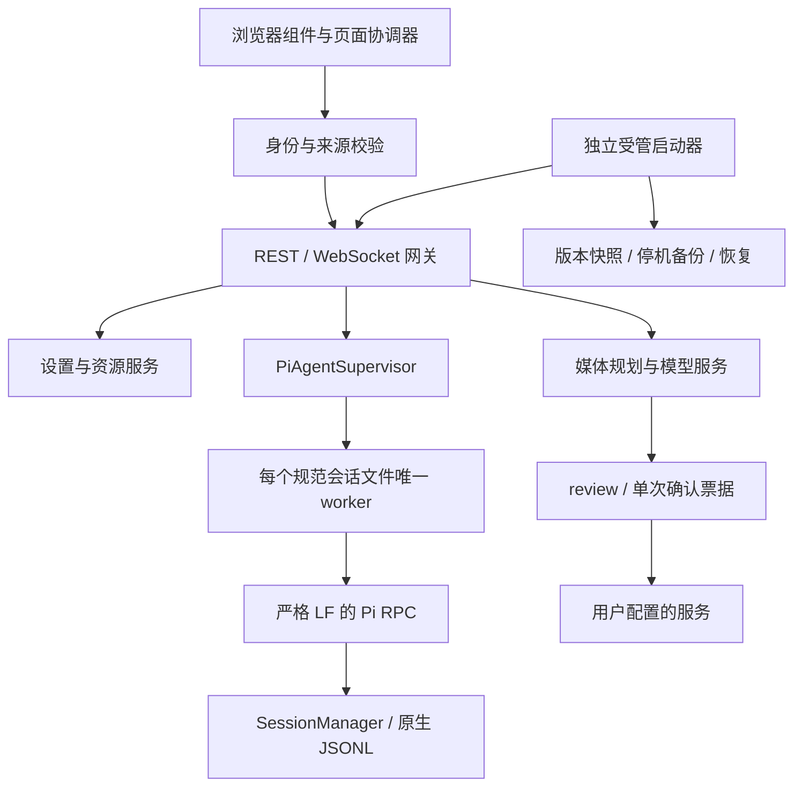

# Pivane 架构

Pivane 是单体部署的 AI 工作台。一个 Express 服务提供同源 REST/WebSocket、浏览器静态资源和媒体入口；Pi Coding Agent 提供原生会话与工具执行；独立启动器负责受管版本和正常停机。源码按功能服务拆分，运行部署保持简单。

具体文件与测试入口见 [模块导航](MODULES.md)，变更流程见 [WORKFLOW.md](WORKFLOW.md)，字段和限额以 [API](../API.md) 及各功能契约为准。

## 职责和依赖方向

- `server.js` 装配访问验证、网关、媒体适配与静态资源，再监听 HTTP。旧媒体执行器仍在此入口，修改这些旧适配器时逐项迁移职责，不向入口添加新的业务存储。
- `pi-agent-routes` 负责网关装配、项目/会话 HTTP 和连接协议。`server/routes/settings`、`server/routes/media` 只适配 HTTP；配置锁、修订、票据和持久化仍由服务拥有。
- `PiAgentSupervisor` 拥有 worker 注册表、启动互斥、重开和回收。路由使用其生命周期接口，不复制 worker 内部字段清单。
- worker 拥有 RPC、事件、导航、Shell、控制队列和私有响应槽。`pi-worker-lifecycle` 集中投影这些工作；界面活动、维护空闲、无人订阅后的回收使用明确的不同条件。后台标题生成会阻止维护，但不占用主 prompt 操作；未处理草稿、队列和不确定操作不能因 agent_settled 被遗忘。
- 功能服务依赖已注入的 store、supervisor、preferences 或公开 Pi SDK。跨服务操作的互斥在 await 前预占，完成后再释放；接口不能把超时当成实际终止。

## 会话与运行时

Pi SessionManager 和原生 JSONL 是唯一会话事实来源。项目先经 native realpath、配置范围和系统权限解析；持久 worker 按规范 sessionPath 唯一索引，多浏览器订阅同一 worker。外部 CLI 不能同时写同一个会话。

PiRpcClient 使用 StringDecoder 并严格按 LF 分帧，不能使用会拆分 Unicode 分隔符的通用行读取器。启动在同一进程中进行有界只读就绪探测；迟到探测和未知私有桥接响应均截获，不重发消息、不另开 worker。

会话目录、ID、项目 cwd 和分支树各有独立含义。创建空会话先独占创建文件，再通过公开 SessionManager 写有效 header。分叉、历史、书签和导入导出复用原生 entries/branch/labels；不维护平行聊天历史。JSONL 导出通常只有当前分支，不能称为完整会话树备份。目录改名另见 [迁移约束](NAMING.md#项目目录改名)。

Pi 0.86 的原生 system message 是供应商 transcript 的提示词/工具检查点。公开聊天边界过滤这类消息，原生上下文和导出仍使用完整记录。保存配置不自动重开 worker，资源重载与配置保存是不同操作。

Pi 0.87 的 `context_edit` 只改变模型上下文。主聊天快照从唯一 worker 的一次 `get_entries` 响应，通过公开 `buildContextEntries` / `sessionEntryToContextMessages` 投影原始记录，保留既有压缩范围和 stdout 同步快照边界，不建立聊天副本。完整上下文侧聊继续使用 `buildSessionContext` 的编辑后投影；历史、搜索、分叉与导出保留原生 entry 与引用。

相关契约：[运行恢复](../NATIVE_COMPLETION.md)、[会话工作流](../SESSION_WORKFLOWS.md)、[历史](../HISTORY.md)、[导入导出](../SESSION_TRANSFER.md)。

## 辅助工作与扩展

- 自动标题通过私有桥接读取有界摘录，使用独立 ModelRuntime 请求，再按名称/分支修订条件保存。资格状态写原生 custom entry；迟到结果不能覆盖用户改名或新分支。
- Agent 任务线程是普通原生持久会话，来源、requestId 和任务状态绑定原生身份。创建预占名额；重复 requestId 查询既有结果，不重放。默认模型来自原生设置，不自动继承来源线程模型或全部历史。
- `TaskCatalog` 对原生会话进行分批只读元数据发现，缓存完整描述符身份和已核实的文件修订；缓存可丢弃，未完成覆盖不能作为创建去重的否定证据。`TaskReturns` 根据原生每轮结果和来源回执协调交付，不维护独立持久任务账本。
- 来源 worker 的私有命令在空闲互斥区保存结果 custom message 和已读 custom entry，不触发模型、不直接从后台追加活跃 JSONL。来源未打开时不启动 worker，重开后补收；任务读取和交付均纳入维护生命周期。
- 侧聊使用受限内存 SessionManager，冻结主会话背景，历史工具调用转换为引用。工具与逐回复确认由独立侧聊管理，关闭、断线和待确认请求有各自生命周期；共享目录不意味着写入隔离。
- 扩展助手仍是受 Supervisor 管理的原生会话，仅身份标记有效的 worker 获得专用管理凭据。安装与配置复用原生资源服务的锁、修订和 trust。
- 任务进度由内置 `update_plan` 工具同步写原生 `pivane-task-progress` custom entry，以完整替换形成确定顺序。启动、分支导航和压缩后从完整当前 branch 恢复，Supervisor 只持有有界展示投影，快照沿用 live sequence 边界；不增加 worker 工作类型或外部任务数据库。模型上下文缺少最新工具结果时由 context hook 补入最新计划数据。
- 工具来源是调用时捕获的有界展示元数据，绑定调用 ID/工具名；旧记录不按当前清单追认来源，也不把来源标记当成权限验证。

相关契约：[辅助模型](../AUXILIARY_MODELS.md)、[任务线程](../AGENT_THREADS.md)、[侧聊](../SIDE_CHAT.md)、[原生设置](../NATIVE_SETTINGS.md)。

## 文件、配置与身份

Pi Provider 身份与工作台访问身份独立。登录/退出使用公开 ModelRuntime API，未知配置字段保留；访问 Cookie/Bearer 与 Origin 分别检查。内部媒体、任务和扩展管理凭据各自限制到必要端点。

文件服务、搜索、用量、备份与恢复复用原生描述符边界。Linux 使用 /proc，macOS 使用 F_GETPATH，Windows 查询 HANDLE 的最终路径和完整身份。打开对象的类型、预算、路径和前后变化均需核对；原生后端不可用时不能回退到未经验证的请求路径。

POSIX 私密权限和目录刷盘、Windows 受保护 DACL 和写透替换分别处理。原生源码、二进制和 manifest 成批分发，普通安装不现场编译。详见 [native](../../native/README.md)。

项目全文读取与目录浏览共用 `pi-file-scope` 的项目范围和私密根规则。`pi-file-browser` 只枚举受控元数据，父目录与返回条目分别验证打开描述符；文件名搜索有扫描、结果、时间与并发预算，不维护持久文件索引，不调用模型。

实例偏好保存置顶、隐藏、归档、完成提醒及辅助模型设置；这些都是原生项目/会话的附属元数据。归档不改变 worker 或 JSONL。搜索只读扫描原生文件，缓存可丢弃。用量由 `pi-usage-service` 串行调度 Worker，`pi-usage-worker` 校验原生来源，`pi-usage-ledger` 事务保存无正文的用量事实、去重指纹、读取游标与时区日汇总；扫描器用完整前缀校验保护追加解析，改写时重新核对；`pi-usage-pricing` 从上游官方供应商目录按精确 ID 取得参考价。用量账本保留已删除会话的统计，必须随身份目录备份；它不参与聊天恢复或 worker 状态。网页删除在停止 worker 后先完成用量入账检查，关闭服务时等待统计线程退出。

## 浏览器

`pi-chat.js` 仍是页面协调器，连接当前项目、会话、流式事件、草稿和独立组件。正文/滚动、工具、文件、侧聊、历史和设置分别由组件负责。继续拆分时优先给状态确定唯一所有者，再提取接口；单纯移动闭包代码不会减少耦合。

`pi-files-panel.js` 拥有文件打开入口、项目／本轮模式、阅读布局与共享查看器；`pi-file-browser.js` 拥有目录缓存、文件名搜索、键盘导航和请求取消。`pi-turn-edits.js` 只从原生消息派生轮次记录并通过共享查看器展示，不再管理项目文件链接。目录偏好按项目保留在本页内存；内容、目录数据与请求在切线程时清空，迟到结果继续检查上下文与连接代次。浏览不会改变草稿或模型上下文。

`pi-model-picker.js` 拥有会话模型面板、全目录搜索和设备本地最近记录，以供应商与模型 ID 元组区分身份。常用模型由 `WorkspacePreferencesService` 保存，HTTP 接口提交单项加星／取消操作；旧浏览器导入带持久回执和取消标记，避免全表覆盖与旧数据复活。组件只把明确的模型选择交回 `pi-chat.js`；RPC、忙碌锁、当前模型和 socket 代次继续由协调器管理，不用常用偏好恢复会话模型。

`workspace-ui.js` 提供 `PiActionFeedback`，负责异步按钮的加载图标、动作文字、无障碍属性及恢复；请求互斥、上下文代次与结果归属继续由各功能组件管理。

`pi-task-progress.js` 拥有输入框上方的计划卡渲染和展开状态，只接受当前连接快照与进度事件，不解析回复文本、不从运行终态推断步骤完成。

`pi-task-results.js` 拥有结果面板的请求、渲染和线程代次检查；协调器只提供当前线程、访问接口和已有安全跳转。结果正文使用纯文本，收到结果不改草稿、附件或当前滚动位置。

快照与有界 live 状态通过 webRuntimeId/webSequence 衔接；agent_settled 后以原生记录校正。迟到响应按线程、socket 代次、revision 和草稿版本过滤。正文模式只改变展示，不改变上下文或会话数据。文件变更来自成功 edit/write 的明确结果，不推算任意 Shell 的净变化或提供虚构回滚。

用户/工具内容使用安全 DOM。Markdown 经 marked + DOMPurify；KaTeX 输出独立清理；Mermaid 在无同源权限 sandbox 绘制后清理为图片。主题、分栏、语言等可保存浏览器偏好；草稿、附件和展开状态主要属于当前页面，不能复制为另一份聊天历史。

界面语言通过明确绑定和词典翻译，聊天、文件和模型参数保留原内容。语言选择在下一次页面打开时生效，不自动刷新正在编辑的页面。

## 媒体

模型目录和参数来自中性默认配置及用户外置配置。规划器只注册当前用途所需的 capability/plan 工具；review 再校验参数并生成有时限的票据，execute 只消费已确认的单项票据。失败和不确定请求不自动重放，跨来源下载不转发 Key。

回复朗读以喇叭点击授权当前回复与默认参数，继续走票据和执行服务。旧媒体适配器兼容保留，不能因为环境已配置就自动成为实验室默认可执行模型。

相关契约：[媒体接入](../MEDIA_CONNECTIONS.md)、[实验室](../MEDIA_LAB.md)、[回复朗读](../REPLY_TTS.md)。

## 安装、维护与交付

普通 node server.js 和 npm start 经独立受管启动器；direct 模式用于明确的独立开发实例。启动器持有安装目录锁，通过私有 IPC 和服务代次处理维护请求，正常停机等待全部登记的 RPC 进程实际退出。SIGINT/SIGTERM 监听在清理结束前保持注册；重复信号不重复清理。

源码工作区、运行 release 与发布归档分别有身份。受管 Pi 更新创建代码/依赖快照，应用更新下载并校验固定官方来源的归档。安装完成和服务启动完成分开记录；失败保留旧版本与证据，不自动恢复数据或重放维护请求。

停机备份使用原始字节、路径和哈希清单，恢复按原路径处理并用 needsRecovery 阻止不完整恢复后启动。项目改名需要额外迁移项目归属与配置引用，不能把原路径恢复器当成目录迁移器。

`scripts/source-files.cjs` 是代码发现与发行文件集合的公共入口；检查、测试、发行包和受管源码快照共同使用。公开文档使用独立明确清单。依赖、用户数据、私有维护仓、备份与运行目录不进入源码发行集合。

版本验收绑定实际归档 SHA256，并说明目标平台、Node/Pi 版本和合成/真实服务范围。当前某个维护实例的启用状态保存在私有维护资料，不能写入公共架构结论。
