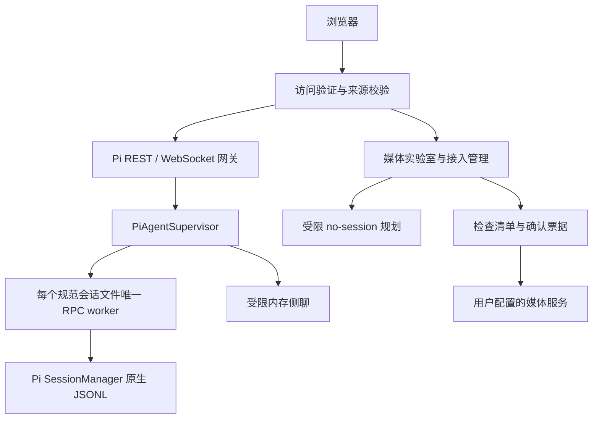

# Pivane 架构

Pivane是一个Express服务及其管理的Pi进程。浏览器使用同源REST/WebSocket与共享静态界面；Pi原生会话管理对话事实，媒体服务独立管理用户确认的生成请求。

## 进程与身份

server.js加载实例环境、创建访问验证服务、Pi网关、媒体管理及静态服务，再监听HTTP/WS。PORT默认3000，HOST由部署配置决定；公开示例采用loopback。身份、数据、项目根和预约路径必须同时隔离，端口不决定媒体后端。

主连接先认证并通过cwd/sessionId解析原生会话，获得state/messages/stats/models/thinking/commands快照。持久worker由规范sessionPath唯一索引，多浏览器订阅同一个worker；临时no-session绑定连接，断开清理。外部CLI不能同时写同一会话。

PiRpcClient使用StringDecoder和严格LF分帧，不能使用readline分割U+2028/U+2029。请求ID关联响应；私有控制响应在Supervisor截获，包括迟到/未知结果。扩展不能替换受管session身份；受控导航只走项目桥接。

保存配置不自动重开运行实例。进程退出由pi-process-shutdown保持SIGINT/SIGTERM监听并去重异步清理，避免Pi依赖的signal-exit提前重发信号；清理失败不返回成功退出码。复合操作await前预占互斥，超时不等于终止；模型刷新、导航、Shell、停止、压缩、资源重载、队列、预约、配置和导出都计入各自活动与回收边界。部署不得停止承载当前维护会话的进程。

## 原生会话与工作流

PiSessionStore通过公开SessionManager列举、新建、命名与删除。空会话先独占创建文件，再SessionManager.open写有效header，避免原生延迟落盘导致不可见。

历史搜索、书签、会话树来自原生entries/branch/labels；不维护第二份索引或历史。书签推进metadata leaf但不改变消息祖先；导航验证leaf/revision，暂停预约，草稿只回给调用者。复制/分叉使用SessionManager创建新身份，不复制项目目录、不撤销工具副作用。

导出HTML经当前唯一worker，JSONL使用官方当前分支导出；导入先严格验证再SessionManager.forkFrom创建新ID。媒体票据和导出回执的进程内幂等不承诺跨重启事务。相关契约见[历史](../HISTORY.md)、[工作流](../SESSION_WORKFLOWS.md)、[导入导出](../SESSION_TRANSFER.md)。

侧聊默认通过现有worker只读捕获当前有效背景，私有管道交给SDK内存SessionManager。禁用工具与资源发现，工具历史转换为只读证据，思考/签名不转移。前端只显示继承边界后的新对话，统计扣除继承基线。票据、后台保留与生命周期见[侧聊](../SIDE_CHAT.md)。

## 文件系统与凭据

pi-platform-path处理Windows路径歧义，pi-file-io与pi-file-descriptor统一安全打开、内核路径和对象身份。Linux使用/proc，macOS使用F_GETPATH，Windows通过Node导出的libuv转换HANDLE并查询最终路径/完整File ID。根、私密路径、类型、预算和前后变化校验保留；后端缺失不退化为请求路径。

Windows受保护DACL在私密文件创建时设置，专用配置/导出目录单独保护；关键持久化使用可写fd刷盘和写透替换。POSIX保留0600/目录fsync。原生源码、二进制和manifest一起分发，普通安装不编译；见[组件说明](../../native/README.md)。

工作台访问身份独立于Pi Provider凭据。Cookie/Bearer与Origin分别检查，认证撤销清理失效连接而保留持久任务。Provider凭据通过公开ModelRuntime.login/logout持久化，前端不回显。内部规划身份仅授权指定端点。参考[访问控制](../ACCESS_CONTROL.md)和[模型设置](../PROVIDER_SETTINGS.md)。

## 浏览器状态

public/pi-chat.js协调当前会话、请求代次、流式消息与附件；专用模块管理滚动、正文/完整记录、菜单、历史、文件、侧聊和设置。共享主题/分栏归workspace-ui，后端模型/字段目录不写死在前端。

messages快照与webRuntimeId/webSequence衔接有界live状态，settled后以原生记录校正；message_end/agent_end不是整轮完成依据。迟到读取按线程、socket代次、revision及草稿版本丢弃。

正文模式仅改变显示，连续思考/工具合并折叠；普通文字、附件、错误、等待确认保留。文件变化只从成功edit/write记录派生，不推算bash或提供净变化/回滚。当前磁盘全文需用户显式读取。

Markdown经marked与DOMPurify。公式由本地KaTeX的独立清理输出生成；Mermaid在无同源权限sandbox中绘制后再次清理为图片。不执行模型HTML或通过展示扩展工具权限。

主题、分栏、正文和界面语言选择可以保存为浏览器偏好；草稿、附件、展开/阅读状态与侧聊内容主要在本页内存。禁止把这些展示状态复制为平行聊天历史。

中英文显示由pi-i18n及成对文案词典管理，静态HTML只翻译显式绑定节点，动态文案在源码展示位置调用。页面打开时确定语言，保存选择在下一次页面打开时生效，不自动刷新或重建编辑中的界面；不扫描翻译聊天、文件或模型参数。已知服务端标签只在显示边界翻译，REST/RPC和原生存储保持原文。详细范围见[界面语言](../I18N.md)。

## 媒体与统计

媒体管理从中性目录和用户外置配置获取模型。规划器只启用对应capability/plan工具；review重新校验参数并发出10分钟票据，用户确认后execute单项提交。失败/不确定不重放，Key不得跨来源下载转发。旧执行器与历史兼容保留，目录不自动注入旧图像/视频adapter。

回复朗读以喇叭点击授权当前回复和默认参数，仍走review/execute。只读用量扫描通过Worker Thread读取原生JSONL，按历史身份去重、预算和日期汇总；不启动RPC，不保存平行历史。通知只保存设备配置和通用事件元数据。

完整协议分别见[API](../API.md)、[媒体接入](../MEDIA_CONNECTIONS.md)、[实验室](../MEDIA_LAB.md)、[用量](../USAGE.md)、[运行恢复](../NATIVE_COMPLETION.md)。Pivane品牌不改变PI_*环境变量、pi5-*文件或API/RPC标识。
